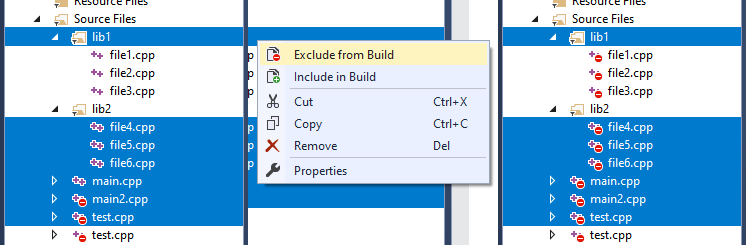

# Exclude from Build
### Extension for Visual Studio 2013, 2015, 2017 and 2019

This extension allows to exclude from build or include in build multiple **C**/**C++**/**C#**/**VB** files and directories with one click.

1. Select directories and/or files you'd like to exclude or include
2. **Right-click** the selection or go to menu **Tools**
3. Choose **Exclude from Build** or **Include in Build**

Files are excluded/included based on file extension:
- **.c**, **.cc**, **.cpp**, **.cxx**, **.c++**, **.m**, **.mm**
  - **Exclude** sets **Excluded from Build** file property to **Yes**/**True**
  - **Include** sets **Excluded from Build** file property to **No**/**False**
- **.cs**, **.vb**
  - **Exclude** sets **Build Action** file property to **None**
  - **Include** sets **Build Action** file property to **Compile**
- **.xaml**
  - **Exclude** sets **Build Action** file property to **None**
  - **Include** sets **Build Action** file property to:
    - **ApplicationDefinition** if the file defines `<Application>`
    - **Page** otherwise

For C/C++ it is possible to affect only the **Active** project configuration (default) or **All** project configurations. Choose one of the options in menu **Tools -> More**.
The behavior of the basic buttons can be changed in **Tools -> Options -> Exclude from Build**.

You can download this extension from [Visual Studio Marketplace](https://marketplace.visualstudio.com/items?itemName=AdamWulkiewicz.ExcludeFromBuild) or [GitHub](https://github.com/awulkiew/exclude-from-build/releases).
